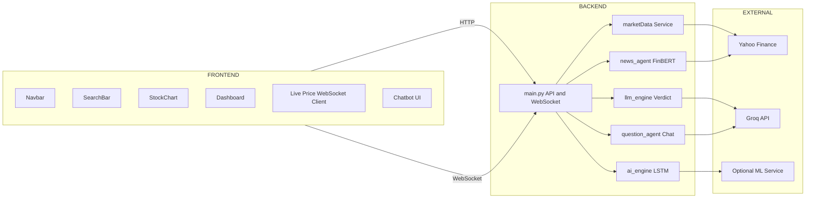
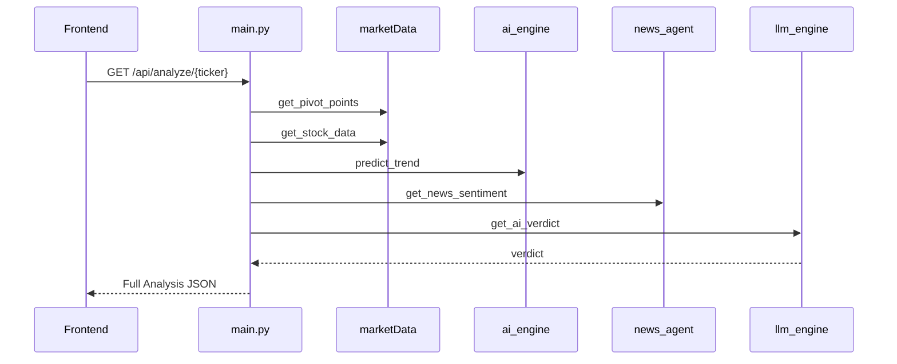
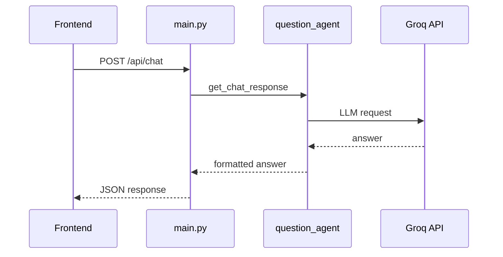

# Trade Sentry — Architecture

This document describes the system architecture, data flow, and main components of Trade Sentry.

---

## Table of Contents

* High-Level Overview
* System Architecture Diagram
* Backend Internal Components
* Data Flow
* API Contract
* Frontend Architecture
* ML Pipeline
* Deployment Considerations
* Summary

---

# High-Level Overview

Trade Sentry is a **three-tier application**:

1. **Frontend** — React SPA (Vite)
2. **Backend** — FastAPI server (orchestrator)
3. **External Services** — Yahoo Finance, Groq API, optional ML service

The backend acts as the central orchestrator.

---

# System Architecture Diagram



---

# Backend Processing Flow



---

# Chat Flow



---

# Backend Components

## main.py

Role:

* Entry point
* CORS
* Routes
* WebSocket handler

Endpoints:

* GET /
* GET /api/analyze/{ticker}
* POST /api/chat
* WS /ws/price/{ticker}

---

## marketData Service

Functions:

* validate_indian_ticker
* get_stock_data
* get_pivot_points
* get_full_chart_data

Source:

* Yahoo Finance via yfinance

---

## ai_engine

Model:

* LSTM (TensorFlow / Keras)

Files:

* app/models/lstm_model.h5
* app/models/scaler.gz

Input:

* Last 60 to 100 closes

Output:

```json
{
  "signal": "BULLISH",
  "confidence": 72.5
}
```

---

## news_agent

Model:

* FinBERT (ProsusAI/finbert)

Input:

* Top headlines from yfinance

Output:

* Aggregate sentiment label

---

## llm_engine

LLM:

* Groq (openai/gpt-oss-20b via LangChain)

Input:

* Ticker
* Price
* Pivots
* Trend
* Sentiment

Output:

```json
{
  "verdict": "BUY",
  "explanation": "Short explanation"
}
```

---

## question_agent

Context-aware chatbot using Groq.

Input:

* Ticker
* Question
* context_data (full analysis response)

Output:

```json
{
  "answer": "Natural language response grounded in context"
}
```

---

# API Contract

## GET /api/analyze/{ticker}

Success:

```json
{
  "symbol": "RELIANCE.NS",
  "price": 2450.50,
  "trend_signal": { "signal": "BULLISH", "confidence": 72.5 },
  "sentiment_signal": "Positive",
  "support_resistance": {
    "pivot_point": 2440,
    "resistance": { "target_1": 2480, "target_2": 2520 },
    "support": { "stop_1": 2400, "stop_2": 2360 }
  },
  "ai_analysis": { "verdict": "BUY", "explanation": "..." },
  "chart_data": {
    "1D": [],
    "5D": [],
    "1M": [],
    "1Y": []
  }
}
```

Error:

```json
{
  "error": "Invalid Ticker or Data Unavailable"
}
```

---

## POST /api/chat

Request:

```json
{
  "ticker": "RELIANCE.NS",
  "question": "What is my stop loss?",
  "context_data": {}
}
```

Response:

```json
{
  "answer": "Based on current analysis, your stop loss is at 2400."
}
```

---

# Live Price WebSocket

Endpoint:

```
/ws/price/{ticker}
```

Server message:

```json
{
  "price": 2450.50,
  "symbol": "RELIANCE.NS"
}
```

Updates every 2 seconds until disconnect.

---

# ML Pipeline

Training notebook:

```
Backend/app/services/train_model.ipynb
```

Outputs:

* lstm_model.h5
* scaler.gz

Inference:

* Loaded at startup
* predict_trend expects >= 60 data points

Optional:

* ml-service/app.py for Lambda deployment

---

# Deployment

Backend:

```bash
uvicorn app.main:app --host 0.0.0.0 --port $PORT
```

Frontend:

```bash
npm run build
```

Environment:

```
VITE_API_URL=https://api.yourdomain.com
GROQ_API_KEY=your_key
```

CORS:

```
allow_origins=["*"]
```

Restrict in production.

WebSocket production example:

```
wss://api.example.com/ws/price/RELIANCE.NS
```

---

# Summary

| Concern     | Implementation      |
| ----------- | ------------------- |
| Market data | yfinance            |
| Trend       | LSTM in ai_engine   |
| Sentiment   | FinBERT             |
| Verdict     | Groq LLM            |
| API         | FastAPI + WebSocket |
| UI          | React + Vite        |

---
